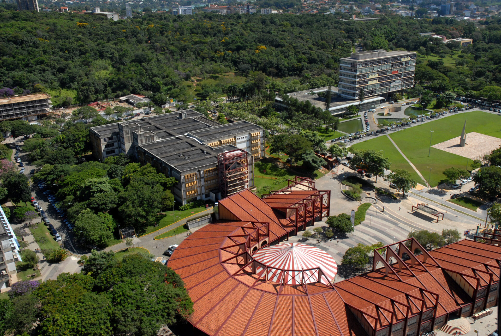

# Belo Horizonte

## About the City

Belo Horizonte, the capital of the state of Minas Gerais, stands out as a hub of culture, academia, and technological innovation in Brazil and Latin America. Known for its welcoming atmosphere and active cultural scene, the city offers a mixture of tradition and innovation.

Belo Horizonte, or simply BH for short, offers a lively cultural landscape, featuring numerous musical genres, from jazz and samba to rock and hip-hop. The city is historically significant in Brazilian music, home to legendary artists and groups like Clube da Esquina, Milton Nascimento, and Sepultura. It also boasts Brazil's largest hip hop battle event, Duelo de MCs, highlighting the city’s active contemporary musical culture.

Historically, BH holds a unique and significant place in Brazilian music. It is the birthplace of a few major artists and influential musical movements. Perhaps the most iconic is Clube da Esquina, a collective of musicians who emerged in the 1970s. This movement, spearheaded by figures like Milton Nascimento and Lô Borges, fused traditional Brazilian sounds with jazz, classical, and psychedelic rock influences, creating a distinctive and highly influential style that resonated globally. 

 

Colloquially known as San Pedro Valley (a nod to Silicon Valley), the city not only hosts big tech offices, from companies such as Google, Amazon, and Thoughtworks, Belo Horizonte is one of the major innovation hubs in Brazil. 

## About Universidade Federal de Minas Gerais (UFMG)

The city hosts the Federal University of Minas Gerais (UFMG), one of Brazil’s most prestigious universities, renowned for its strong programs in Computer Science, Music, and the Arts. Additionally, the city hosts several other institutions, both public and private, providing a solid base of local academic support and infrastructure. 

In particular, UFMG has been a major seed for both major companies and startups providing talent and research to fuel innovation and research. One of the most famous success stories from the university is on fomenting the startup (Akwan) that led Google to develop offices within the city. More recent success stories come from Kunumi, an AI focused startup with roots at UFMG that has been recently sold to one of the major banks in Brazil.

The university also hosts the innovation hub known as BH-TEC (Belo Horizonte Technology Park), where several technology-based companies, R&D centers, and university spin-offs are located.

 