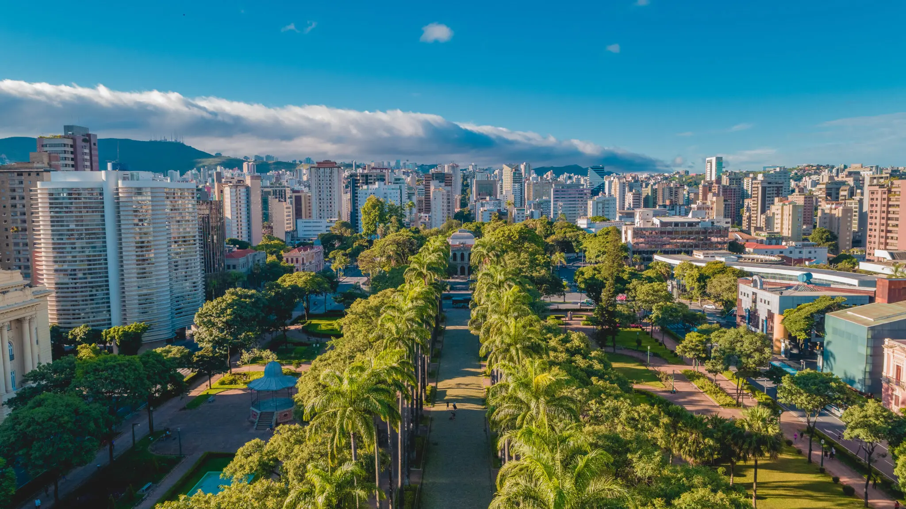

 

Join us for the 2nd Latin American Music Information Retrieval (LAMIR)
workshop, from December 14 to 17, 2026, in Belo Horizonte, *Brazil.*

LAMIR provides opportunities for
local students and researchers to cultivate the Latin American community within
the [International Society for Music Information Retrieval](https://ismir.net/) 
(ISMIR) and the Artificial Intelligence (AI) communities.

The workshop will take place on December 14 – 17, 2026, at the Universidade
Federal de Minas Gerais (UFMG) in Belo Horizonte, Brazil.

Please see the [Call for Papers](call4papers) page for more information.

Similar to LAMIR 2024, we plan on offering financial support in the form of travel
awards to local Latin American students. Please check back soon.

Please feel free to contact us with any questions or concerns related to the 
workshop at
<a href="mailto:lamir.workshop@gmail.com">lamir.workshop@gmail.com</a>.

---

**Important Dates**
* June 26, 2026 - Submission Site Opens
* July 17, 2026 - Travel Support Grants Opens
* August 21, 2026 - Paper Abstract Due
* August 28, 2026 - Paper Submission Due
* September 18, 2026 - Acceptance Notification for Papers and Travel Support
* Monday, December 14 to Wednesday, December 17, 2026 - Workshop
