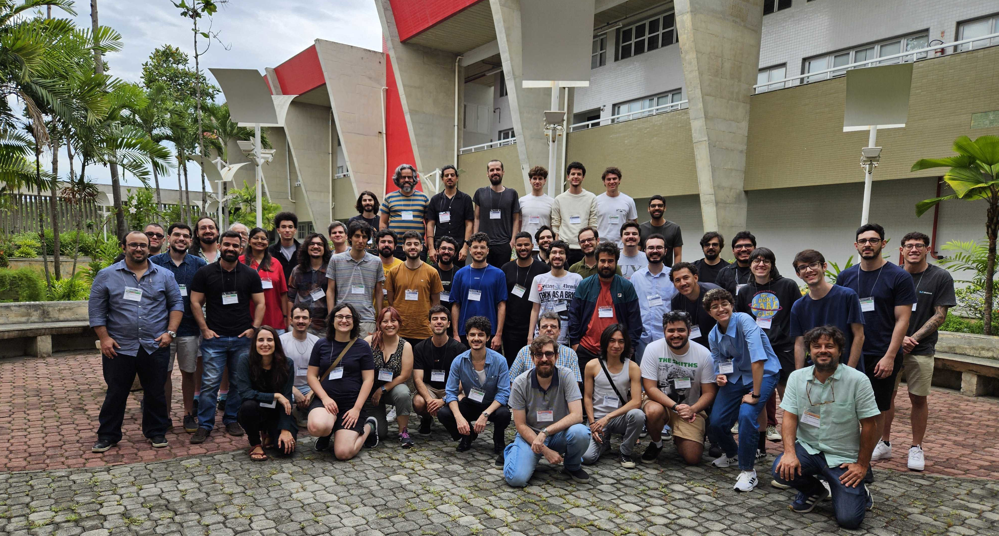

 

Welcome to the official website of the 1st Latin American Music Information
Retrieval (LAMIR) Workshop! LAMIR is a satellite event of the ISMIR 2024
conference and part of the [KHIPUx](https://khipu.ai/) 2024 events. It provides opportunities for
local students and researchers to cultivate the Latin American community within
the [International Society for Music Information Retrieval](https://ismir.net/) (ISMIR) and the
Artificial Intelligence (AI) communities.

The workshop will take place on December 9 – 11, 2024, at the Universidade
Federal do Rio de Janeiro (UFRJ) in Rio de Janeiro, Brazil.

Please see the [Call for Papers](call4papers) page for more information.

We are offering financial support in the form of travel awards to local
Latin American student authors of accepted papers. For more information on how to
apply, please visit the [Travel Awards](travel_awards) page.

Please feel free to contact us with any questions or concerns related to the workshop at <a href="mailto:lamir.workshop@gmail.com">lamir.workshop@gmail.com</a>.

---

**Important Dates**
* Friday, July 12, 2024 - Submission Site Opens
* Friday, September 6, 2024 - Abstract Submission Due
* Friday, September 20, 2024 - Paper Submission Due
* Friday, October 18, 2024 - Acceptance Notification
* Friday, October 18, 2024 - Travel Award Applications Open
* Friday, October 25, 2024 - Registration Opens
* Friday, October 25, 2024 - Travel Award Applications Close
* Friday, November 1, 2024 - Camera-Ready Submission Due
* Friday, November 1, 2024 - Travel Award Notification
* Friday, November 15, 2024 - Non-Author Travel Award Applications Close
* Friday, November 22, 2024 - Non-Author Travel Award Notification
* Monday, November 25, 2024 - Early / Author Registration Closes
* Monday, December 9, 2024 - Standard Registration Closes
* Monday, December 9 to Wednesday, December 11, 2024 - Workshop

---

### Workshop Proceedings

 [**Proceedings of the 1st Latin American Music Information Retrieval Workshop (LAMIR)**](https://zenodo.org/records/14908040), Rio de Janeiro, Brazil, December 9-11, 2024 (ISBN: 978-65-01-30797-8) [[pdf](https://zenodo.org/records/14908040/files/LAMIR2024_proceedings.pdf)]

---

### Thanks for the amazing workshop!
 

 
